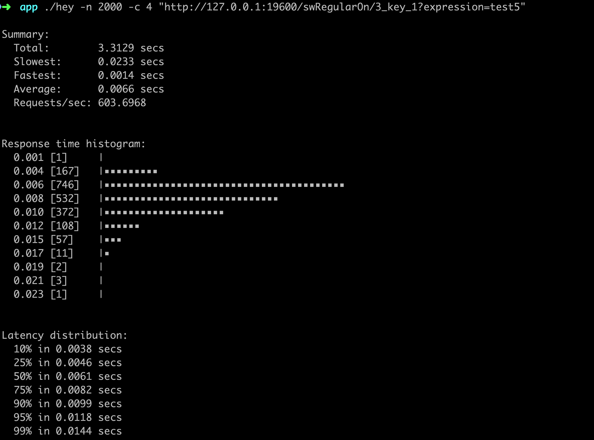

# 本地开发说明

在SwitcherApplication 主函数的启动命令新增一个参数 -Dconfig=resource文件下的server.config 绝对路径

# 打包

maven  -Dmaven.test.skip=true -P PRO

复制 swServer.sh , resource目录下server.config 和jar 放入同一目录 执行swServer.sh 即可

# 压测报告

## 运行环境
Mac： 2.8 GHz Intel Core i7 4核

并发4 ， 请求20000

Summary:
  Total:	3.3129 secs
  Slowest:	0.0233 secs
  Fastest:	0.0014 secs
  Average:	0.0066 secs
  Requests/sec:	603.6968